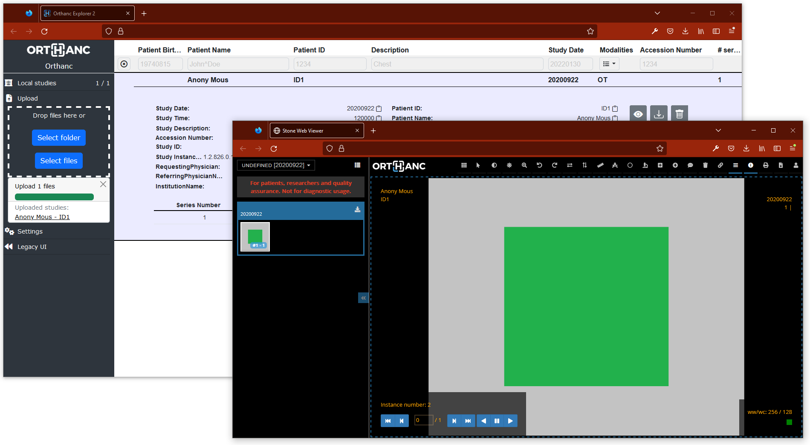

# 🩻 Orthanc on Azure ☁

<h3 align="right">Colby T. Ford, Ph.D.</h3>

This template repository deploys all the required Azure services to run the Orthanc DICOM viewer on Azure.

This uses a base Orthanc Docker image from the [Osimis](https://www.osimis.io/) team, which is then customized with environment variables to connect to the backend Azure resources.




## Terraform Steps

This repository uses Terraform to deploy all the required services to run the Orthanc DICOM viewer on Azure. (You can learn how to install the Terraform CLI [here](https://developer.hashicorp.com/terraform/tutorials/aws-get-started/install-cli).)

First, login to Azure using `az login`.

To see what is going to be deployed, run:

```terraform
terraform plan
```

Then, run the following command and type `yes` when prompted.

```terraform
terraform apply
```

In a few minutes, all of the services will be deployed. Once the deployment is complete, navigate to [https://portal.azure.com](https://portal.azure.com) and locate your Resource Group (named something like `orthanc-dev-123-rg`).

## Docker Build Steps

The Docker image will be built with environment variables and will need to be pushed to the Azure Container Registry. 

First, you must modify the `orthanc.json` file in this repository with the credentials and keys from your Azure services that were just deployed. You can also add users to Orthanc in the `RegisteredUsers` section of the file.


### Build Dockerfile

When you build the Dockerfile, it will use the credentials and settings specified in the `orthanc.json` file.

```bash
docker build -t <CONTAINERREGISTRY>.azurecr.io/orthanc-viewer-001:latest .
```

### Run Locally
```bash
docker run --name orthanc-viewer-001 -p 8042:8042 <CONTAINERREGISTRY>.azurecr.io/orthanc-viewer-001:latest
```


### Push Image to Azure Container Registry

```bash
az login
az acr login --name <CONTAINERREGISTRY>

docker push <CONTAINERREGISTRY>.azurecr.io/orthanc-viewer-001:latest
```

Note: You will need to restart the Web App in Azure so that it can pull the newly pushed image.
